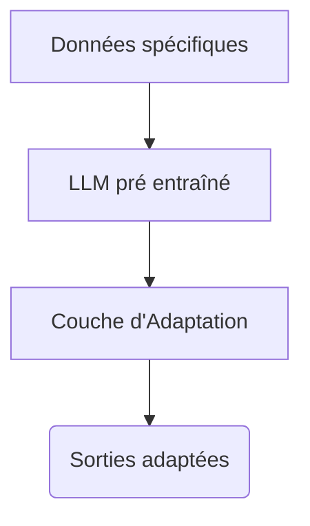
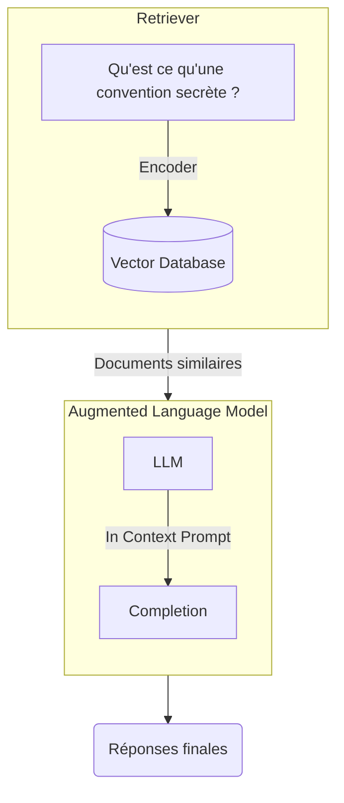

# Fiabiliser les LLM : quelques pistes

Le succès de ChatGPT est dû pour beaucoup à sa capacité presque mimétique de dialoguer. En greffant à GPT une mémoire des échanges et une amélioration des réponses grâce au *feedback* humain, les équipes d'openAI ont créé un agent conversationnel tellement bluffant que son utilisation s'est répandue comme une traînée de poudre. 
Sa connaissance extensive dans presque tous les domaines lui confère un pouvoir de quasi-oracle répondant à toutes les questions que nous, pauvres humains, pouvons lui poser. 

Cet enthousiasme a fait oublier à certains la nature même de GPT et les conséquences sur ses réponses. Il ne s'agit 'que' d'un modèle de langage, c'est-à-dire une machine à produire des mots selon une approche probabiliste, d'où le diminutif de *stochastic parrot* que certains lui ont afffublé. La nature profonde de GPT a deux conséquences : 

 - il a une "connaissance" paramétrique d'un monde figé ;
 - le modèle peut halluciner c'est-à-dire fournir des réponses inexactes factuellement ou de pur non-sens. 

La connaissance figée est due au fait que ce type de modèle est extrémement coûteux à entraîner et qu'il n'est pas possible de le mettre à jour en temps réel. 

L'hallucination provient du fait que GPT ne contient pas une base de données interrne de ses sources. Il est constitué de poids (paramètres) appris lors de la phase d'entraînement qui lui permettent de générer un mot (appelé token) en fonction de la séquence des mots qui lui sont fournis. Rien de plus. La grande masse des données d'apprentissage ne reste pas dans le modèle. Il peut donc produire une sortie qui n'est pas fiable sur le plan de la vérité et même incohérente pour notre bon sens d'être humain. Les deux travers étant cumulables. 

Pis, sa manière de s'exprimer avec confiance ajoute une couche dans la duperie, si j'ose dire. Comment ne pas croire un système qui connaît tout ou presque, de la théorie musicale en passant par la médecine et la physique quantique. Une aussi grande connaissance, affirmée avec aplomb, ne saurait mentir. Non seulement, il ment mais en plus il ne le sait pas ! 

Cet inconvénient majeur a été également gommé par la guerre récente que se livrent Google et Microsoft concernant la recherche améliorée par ces modèles de langage. Ce n'est pas pour rien que Google n'avait pas intégré dans la version grand public son modèle maison (LaMDA). 

Pourtant, il existe des parades pour se prémunir, partiellement, de ces faiblesses. L'avantage de ces approches est de pouvoir bénéficier du meilleur des deux mondes : la capacité à manipuler la langue associée au LLM et le pouvoir de rendre l'information fiable en traçant les sources. 

Pour y parvenir, il existe trois techniques : la première, le *fine tuning*, consiste à adapter le LLM avec des données spécifiques produites et maîtrisées. La deuième consiste à piloter le LLM, *via* le prompting, pour restreindre le contexte de sa réponse. Enfin, la dernière est de mixer une approche de base de connaissances avec une capacité de recherche dont les réponses seront traitées par le LLM dans la phase finale. 

## Le *fine tuning* 

Il ne faut pas oublier que la connaissance présente dans le LLM n'est pas connue et, par conséquent, doit être considérée comme non fiable dans la plupart des contextes métiers. Les modèles de langage pré entraînés sont de véritables boîtes noires dont l'explicabilité des sortes n'est pas possible.

Le fine tuning consiste à adapter le modèle figé à des tâches spécifiques. Les modalités de l'adaptation peuvent être diverses. Par exemple, chatGPT est [issu du fine tuning de GPT](https://huggingface.co/blog/rlhf).

Une des manières d'adapter un modèle pré entraîné est d'ajouter une couche de données d'apprentissage. On adapte ainsi un modèle pré-entraîné à un domaine spécifique. Cette approche est très utilisée car elle permet de se passer de la phase d'entraînement très coûteuse qui fait la force des LLM. 

Le fine tuning, dans une approche de fiabilisation, des réponses n'est pas la panacée, et ce pour plusieurs raisons : 

 - l'ensemble obtenu reste figé au sens où il faut un ré entraînement - même minimal - pour mettre à jour les connaissances ;
 - les données d'adaptation pèsent un poids infime face aux données d'apprentissage initial et donc n'ont que peu de poids dans le rendu final. 

Pour pallier ces inconvénients, une autre approche est d'utiliser le prompting pour limiter la réponse du LLM à un contexte particulier. 

## Le prompting contraignant et l'injection de contexte

Une solution simple consiste à contraindre le modèle par une instruction de type "Fourni une réponse la plus fiable possible et, si tu n'es pas sûr de ta réponse, réponds "Désolé, je ne sais pas". Ce simple prompt permet de limiter le modèle dans la confiance qu'il apporte à la réponse.  En principe... 

Une manière plus efficiente est, selon moi, d'ajouter un contexte au prompt. Le contexte consiste à limiter la réponse au prompt par le LLM avec un élement de contenu particulier qui va restreindre sa completion comme l'illustre l'exemple suivant: 

||

Cet angle semble plus prometteur et plus sûr que la première approche plus générale. Mais cela ne répond pas à la question de l'actualisation des connaissances. Cette problématique fait l'objet depuis plusieurs années de travaux de recherche. Une des solutions consiste à mixer les LLM avec des outils de recherche sémantique plus "traditionnelles"
ssets/img/prompt_gpt_ccass1.png)

## L'approche in-context RALM (Retrieval Augmented Language Model)

Celle-ci vise à combiner trois couches : 

- la première traite la requête qui est transformée en vecteur (encoder) ;
- la requête est comparée à une base de connaissances stockée généralement sous forme de vecteurs mais une approche plus traditionnelle (statistique) est possible ; 
- les documents obtenus sont ensuite re-traités via un LLM pour répondre à une question, fournir un résumé à partir de plusieurs documents, etc. 

Ce modèle présente plusieurs avantages : 

- l'information peut être mise à jour en temps réel car la base de connaissances est dynamique ; 
- l'information est fiable car maîtrisée par le maître d'œuvre ;
- les résultats utilisent la puissance des LLM pour effectuer des tâches comme les questions/réponses ou des résumés. 

Parmi les projets en cours, deux abordent cette question sous l'angle de la recherche sémantique et de la capacité à retravailler les résultats obtenus en utilisant les LLM. 

---------------------

Liens utiles : 

https://www.topbots.com/overcoming-the-limitations-of-large-language-models/
https://bdtechtalks.com/2023/01/30/ai21labs-llms-ralm/
https://towardsdatascience.com/chatgpt-insists-i-am-dead-and-the-problem-with-language-models-db5a36c22f11
