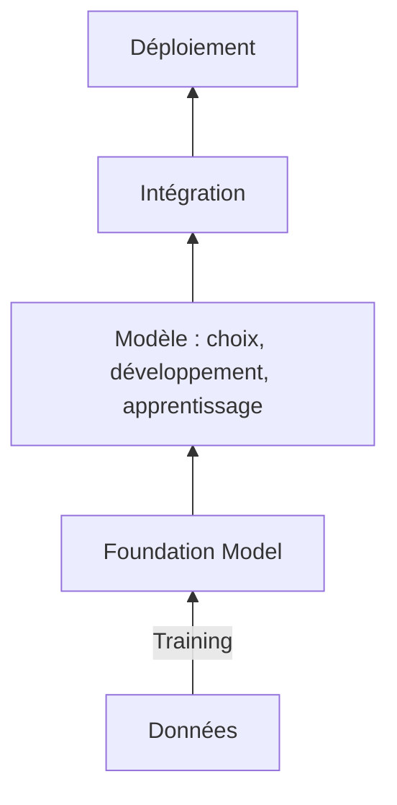
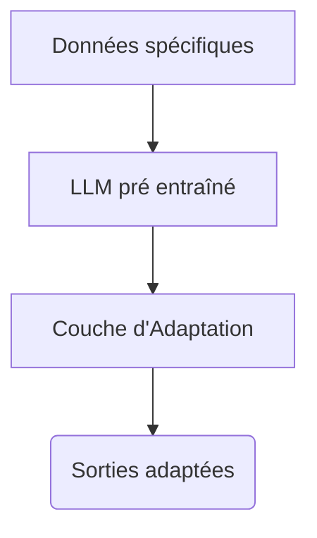

# L'utilisation des modèles pré-entraînés

Liens :
https://arxiv.org/abs/2108.07258

La performance des modèles de type LLM repose sur leur capacité d'ingestion d'un nombre considérable de données. L'autre facteur de performance est le nombre de paramètres entraînable grâce à de nouvelles architecture (les Tranformers) et la capacité de nouvelles unités de calcul (les GPU). 

La conséquence a été l'émergence de modèles avec un nombre de paramètres dépassant plusieurs milliards comme l'illustre le graphique ci-dessous. 

*Trend of sizes of state-of-the-art NLP models over time on a logarithmic scale*
*Source: Microsoft Research blog post on 11th Oct 2021*

Cette inflation pèse sur les coûts d'entraînement et la capacité à délivrer les inférences. Ces deux postes de dépenses ne sont pas accessible à la plupart des acteurs publics ou privés.

Ce phénomène a également favorisé l'émergence des *Foundation Models*, c'est à dire de modèles généralistes servant de socle de base à des entraînements spécialisés. 

Ces deux caractéristiques, performance des modèles liés à leur obésité et le facteur coût, influence fortement les modes de consommation pour les utilisateurs. 

Sans entrer dans les détails, je détaillerai  les avantages de la réutilisation après avoir expliciter leurs contours et modalités. Enfin, plusieurs points critiques seront soulevés car ils peuvent avoir des impacts éthiques/juridiques clés dans le cadre de projet d'IA touchant au language. 

## Le phénomènes des *Foundation Models*

## Les modalités de la ré-utilisation

Les avantages 

Cette situation 
La réutilisation correspond à des besoins précis exprimés par le marché. Cette consommation de modèle sur étagère autorise un adaptation partielle mais elle n'est pas sans risque notamment en raison de la dépendance qu'elle fait naître vis à vis du fournisseur. 

Cette forme de consommation fait accroître la dépendance vis à vis des fournisseurs dans certains cas. 

Les avantages de la réutilisation

Rapidité 
Coût 
Double effet boîte noir 

Des solutions sous forme de librairie ou en SaaS

OpenAI
HuggingFace 

L'adaptation des modèles 

fine tuning
prompting

Postion du problème : les paramètres figés d'un modèle 

Ce document ne fait pas référence [[au prompting]] ce qui est problématique car c'est une manièr d'utiliser les modèles. 

## Une grande variété de modèles 

Depuis 2017, de [nombreux modèles de transformers](Zoom sur la connaissance paramétrique ) ont été entraînés. Surtout, de nombreuses variations ont été élaborés, parmi lesquelles : 
- [BERT: Pre-training of Deep Bidirectional Transformers for Language Understanding](https://arxiv.org/abs/1810.04805), Jacob Devlin et al.
- [FlauBERT: Unsupervised Language Model Pre-training for French](https://arxiv.org/abs/1912.05372), Hang Le et al.
- 

De nombreuses librairies logicielles permettent de les utiliser tel quel ou après une opération de fine-tuning. 

## L'utilisation des modèles 

### utilisation après fine-tuning 

### utilisation tel quel  avec invite de commande (prompting)

Le P de GPT signifie pré-entraîné. L'objectif premier est de générer des mots en fonction des précédents. La masse d'information utilisée et le nombre de paramètres sont tellement considérables que l'on s'est rapidement aperçu que ces modèles de la famille des Large Language Model (LLM) étaient capables de répondre à plusieurs tâches : classification, reconnaissance d'entité, résumé, question/réponse, ... Alors qu'il fallait auparavant plusieurs modèles spécialisées, ils sont capables d'être multi-tâche alors qu'ils n'ont été entraîné pour aucune d'elle en particulier. Mieux encore, ils peuvent s'en acquitter avec un paramètrage minimal comme nous le verrons.

Le tableau ci-après illustre l'inflation considérable du nombre de paramètres des modèles qui constituent une facteur de performance mais aussi une barrière à l'entrée.
|  

---

---

Avant d'utiliser GPT3, il faut transformer les mots en unité élémentaire appelée tokens.

Dans notre exemple précédent, concernant le modèle word2vec, on s'est contenté d'isoler les mots un par un et de bâtir un vocabulaire. En NLP, la notion de token est plus large que celle de mots. C'est une unité élémentaire qui est utilisé par un modèle - un réseau de neurones - pour apprendre une tâches. Il peut représenter un mot, une partie de mots, un caractère unique, un signe de ponctuation, un caractère spécial ou spécifique à un modèle, etc. D'ailleurs, dans la documentation d'openAI, il est indiqué qu'un token équivaut, en anglais, à 0,75 mots.

  

Un modèle comme GPT consomme des tokens en entrée. Cela signifie qu'il faut d'abord transformer vos données en tokens avant leur utilisation par le modèle. Les tokenizers modernes, comme ceux utilisé par la famille GPT, permettent de ne pas avoir de mots qui ne serait pas dans la vocabulaire car ils utilisent des sous-parties leur permettant de recomposer les mots inconnus qu'il pourrait voir hors des données d'entraînement.

Le nombre de tokens que le modèle peut consommer en entrée est limitée. Cela est vrai de tous les transformers qui traitent des séquences de longueur fixe en entrée. L'interface d'OpenAI fournit d'ailleurs un compteur de tokens. C'est également l'unité de mesure du prix facturé qui est fondé sur le nombre de tokens consommé à chaque appel de l'API.

Une fois la phrase tokénisée, le modèle produit une donnée de sortie qui correspond à la probabilité qu'un mot soit le suivant de ceux déjà renseigné. En réalité, il s'agit des probabilités distribuées à travers tous les tokens qui compose le vocabulaire du modèle. On peut choisir la plus élevé mais également celle qui sont plus rares. L'essentiel est que la génération reste cohérente. Parfois, le modèle hallucine au sens où la réponse est valable sur le plan formel mais incohérente dans son sens.

Cette phase de sortie peut être paramètrée via l'interface d'openAI ou de la plupart des librairies. On peut notamment choisir le dégré de créativité du modèle, c'est à dire sa capacité à choisir des tokents trés fréquents ou plus rares vu pendant la phase d'entraînement.

Voici un exemple concret de tokénization d'une phrase. Nous allons utilisé la librairie transformers du [site Huggingface](https://huggingface.co/)

Les modèles généralistes en français : 
https://huggingface.co/models?language=fr&sort=downloads 

Les modèles spécialisés en français : 
http://nlp.polytechnique.fr/resources ( juribert)
d'autres exemples dans le papier https://arxiv.org/abs/2110.01485 
