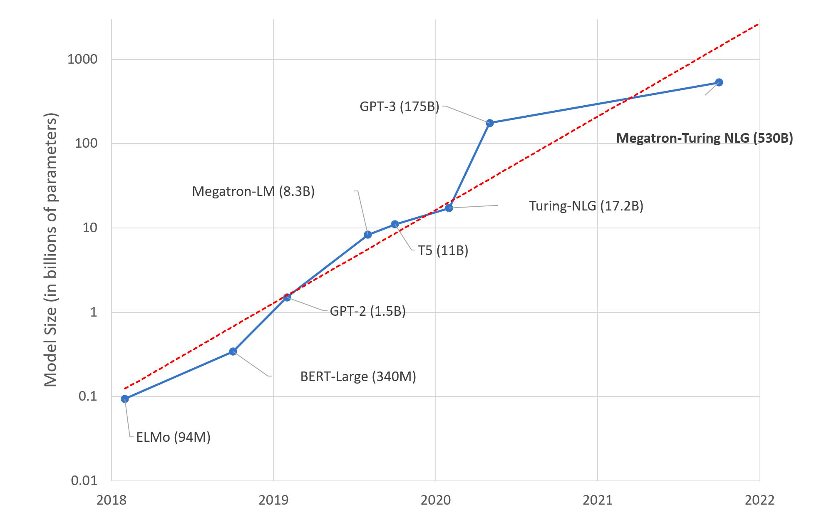
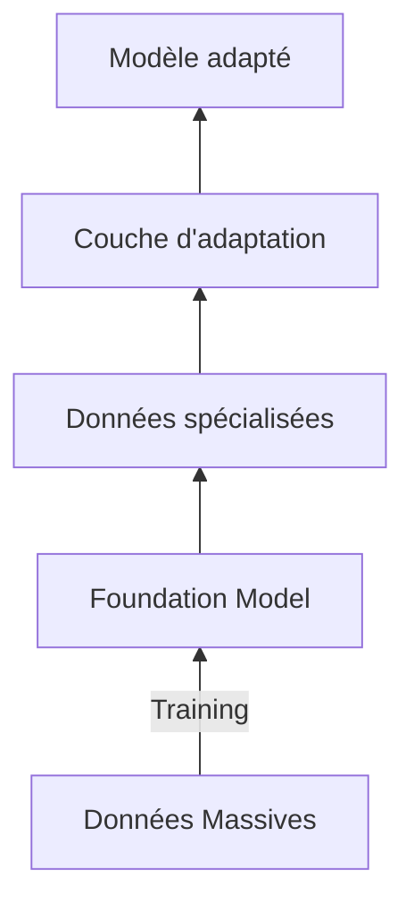

# L'utilisation des modèles pré-entraînés

En matière de traitement du language, il est extrémement fréquent d'avoir recours à un modèle déjà existant que l'on re-entraîne sur des tâches spécifiques. 

Ce phénomène est d'abord apparu avec les images au début des années 2010 puis, à partir de 2018 et la sortie du modèle BERT, s'est invité dans le monde du NLP. 

Auparavant, les tâches étaient silotées ainsi que les équipes de recherche. On distinguait classiquement plusieurs catégories :

- la classification d'une phrase ou d'un document (spam, fake news, critique, ...)
- ll labelisation de séquences (prévoir la nature grammatical d'un mot, reconnaître des entités)
- l'établissement des relations entre les séquences (sujet, verbe, objet)
- la génération de texte : traduire ou résumé par exemple. 

A chacune de ces tâches, on associait un modèle, des données et un entraînement. Désormais, l'état de l'art est d'utilisé un premier modèle comme socle de connaissance puis d'entraîner des couches de neurones spécifiques associées à des données nouvelles en vue de spécialiser l'ensemble. 

Ce nouveau paradigme a des implications qui vont bien au delà des aspects purement technique de la discipline. Avant de décrire sommairement la traduction technique et concrète pour les praticiens,  il faut revenir sur l'origine de ce phénomène. 

## Des modèles pré entraînés aux *foundation models*

### Les conditions de l'émergence 

L'émergence de cette pratique épouse les mêmes conditions que le succès fulgurant du *deep learning*  ces dernières années : 

 - augmentation de la puissance machine grâce au GPU; 
 - élaboration de nouvelle architecture plus facilement entraînable (Transformers); 
 - explosition du nombre de données disponibles. 

C'est ce dernier phénomène qui a été le plus massif dans le secteur du langage. Dans le secteur, il est fait recours massivement à l'apprentissage auto-supervisé  (*self supervised learning*). Par exemple, un modèle qui vise à apprendre à générer des mots a uniquement besoin de phrases en entrée. Le label est constitué par le mot qui est masqué et qui doit être découvert par le modèle.  

Cet aspect est essentiel car il a permis de recourir à une volumétrie massive de données à moindre coût car sans intervention humaine. Cette manière d'entraîner les modèles est l'état de l'art en NLP depuis 2019. 

Le monde de la recherche a rapidement établi que l'alliance de ces modèles sur étagère associés à des couches spécialisées, dans le cadre d'une approche dite de  *transfer learning* (1976, Bozinovski) ,étaient bien plus performante que l'état de l'art antérieur basé sur des architecttures spécialisées. 

Dès lors, une course effrénée  dans la création de modèles toujours plus massif aussi bien en terme de volumes de données d'entraînement qu'en nombre de paramètres comme en témoigne ce graphique : 

*Trend of sizes of state-of-the-art NLP models over time on a logarithmic scale*
*Source: Microsoft Research blog post on 11th Oct 2021*

### La formalisation du concept de modèle socle ou *foundation model*

Née de la pratique, les modèles pré entraînés ont rapidement été renommés *foundation model* ou modèle socle pour signfier à la fois leur place dans l'architecture finale mais également les enjeux fondamentaux en jeu bien au delà du domaine du *machine learning*. 

Je ferai une étude plus détaillé sur les implications, notamment juridique, de cette pratique de l'industrie. 

Pour l'heure, d'autres aspects commandent les modalités pratiques d'utilisation avec ses avantages et ses risques. 

## L'utilisation des foundations models 

La production de ces modèles massifs n'est accessible qu'à quelques entreprises sur le plan mondial compte tenu des ressources et des compétences à mobiliser. 

Cet constat a provoqué également un arrêt partiel des pratiques permettant d'étudier et de reproduire les modèles en laboratoire. A cela, il faut ajouter, comment mentionné dans la partie sur les datasets, la gestion d'une volumétrie gigantesque et l'absence de transparence qui caractérise souvent l'industrie privée dans ce domaine. 

Dans ce panaroma pessimiste, il faut mentionner plusieurs initiatives visant à contre- carrer cette évolution comme [Eleuther.ai](https://www.eleuther.ai/) ou [BLOOM ](https://huggingface.co/bigscience/bloom)à l'initiative de la société HuggingFace et qui a reçu des financements publics français. 

Cet état de fait ne se limite pas à la production mais influe également l'utilisation car les conditions techniques et [le coût économique associé](https://www.forbes.com/sites/johnkoetsier/2023/02/10/chatgpt-burns-millions-every-day-can-computer-scientists-make-ai-one-million-times-more-efficient/?sh=6a05825c6944) pour mettre en oeuvre les inférences est là encore démésuré. 

## Panorama des conditions d'utilisation

De manière simplifiée le schéma d'utilisation est le suivant : 

L'objectif est de se servir d'un modèle de base qui présente une performance élevé dans des tâches généralistes pour le spécialiser à travers différents opérations : 

### Le transfer learning 

Cette opération consiste à entraîner spécifiquement une ou plusieurs couches de neurones supplémentaire adaptées à l'objectif final(classification, labélisation, ...). 

Cet entraînement nécessite également des données métiers mais en quantité bien moindre que les données généralistes de base. Cette disproportion n'est pas sans causer parfois des problèmes de cohabitation. 

On aboutit, au final, à un modèle hybridé qui est souventplus performant qu'un réseau entraîné seul mais [ce n'est pas toujours le cas.](https://arxiv.org/pdf/2211.02563.pdf) 

### Zero ou few shots learning

Cette pratique a émergé avec les modèles de type LLM (*Large Language Model*) comme GPT. On évoque là des archictures dont les paramètres sont supérieurs à plusieurs centaines de millions. 

Elle consiste à piloter le modèle en lui donnant des instructions ou très peu d'exemples. On utilise alors sa capacité généraliset en l'orientant spécifiquement. Je reviens sur ce phénomène dans l'art du prompting. 

### Utilisation packagée

J'entends par là, l'utilisation de solutions proposés et déjà entraînés dans des domaines particuliers. 

Ainsi, vous trouverez chez Amazon ou Google, des services prêt à l'emploi permettant de libre des papiers d'identité, des factures, des déclarations de revenus (US) ou des documents comptables. 

