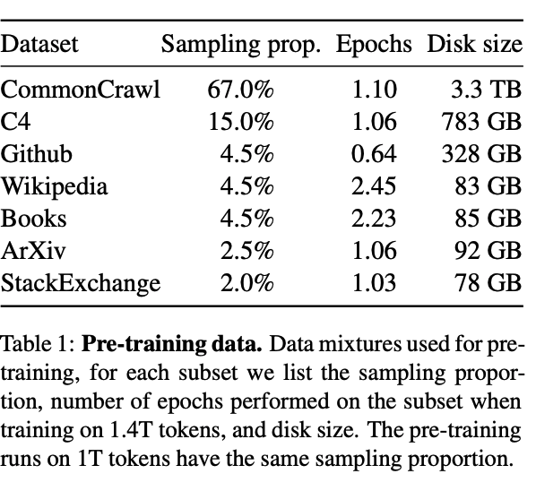

# Les jeux de données (dataset)

L'essor du *Deep Learning* tient à trois facteurs : 
 - l'augmentation de la puissance de calcul;
 - la mise au point de modèles plus performants comme les Transformers;
 - l'explosion du volume des données d'apprentissage;

Les données sont le carburant des algorithmes d'IA. Elles entretiennent une relation intime avec les modèles d'inférence car, à côté de l'architecture, elles en sont le constituant essentiel. Leur qualité et leur défaut se transmettent tout au long de la chaîne de production du projet de *Machine Learning*. 

Dès lors comprendre leur condition de production, leur structure interne et leur typologie est essentielle. 

## L'élaboration des jeux de données 

La mise au point d'important jeux de données est un enjeu stratégique. Nous contribuons, souvent sans le savoir,  à l'élaboration de ce carburant en ajoutant des photos sur les réseaux sociaux ou en qualifiant des photos de feux rouges !

La collecte et la structuration en vue de l'apprentissage constitue un enjeu en soi et une fraction importante du temps dans une projet d'IA. 

### Les producteurs 

Il existe **deux types de producteurs** qui travaillent souvent en collaboration : 
 - le monde de la recherche universitaire
 - les acteurs majeurs de l'IA (Google, Meta, OpenAI, ...)

La **langue anglaise est largement dominante** en raisons de l'origine des acteurs clés à l'origine des LLM et du volume de données où cette langue domine largement. 

Cela a une influence sur la performance des modèles pré entraînés car leur utilisation dans un contexte de langues moins fréquentes comme le français se fait souvent à partir de traduction de mauvaise qualité. 

Cette prédominance, avec l'explosion des projets, est lentement remis en cause avec la multiplication des datasets multilingues comme[ OSCAR](https://oscar-project.org/).

### La matière première

Les datasets  sont constitués d'une quantité très importante de textes d'origines très diverses : 
- Wikipedia
- presse généraliste et spécialisée
- webcrawling (Common Crawl)
- papiers scientifiques
- documents métiers
- livres
- petites annonces & forums
- ...

A ce sujet, **la transparence n'est pas la règle** et les papiers de recherche, édités à l'appuie des nouveaux modèles, ne sont pas précis sur la répartition des matières ou les volumes finaux traités lors de l'apprentissage. 

Un des sujets clés à l'avenir est la récension structurée des données d'entraînement en s'appuyant sur les normes existantes par exemple en matière de *Big Data* et une analyse de risque claire à ce stade des projets. 

Une fois la collecte effectuée, les données doivent être structurées pour répondre à des objectifs d'apprentissage précis. 

### Une structuration en fonction des objectifs 

On distingue deux types d'approche qui sont lié directement au type de données à fournir au modèle : 
- l'approche supervisé (*supervised learning*) qui consiste à qualifier (labeliser) les textes. Une tâche typique es la classification (spam/non spam) qui nécessite en amont une qualification humaine
- l'approche non supervisé (*unsupervised learning*) qui consiste à fournir des données sans labelisation pour des tâches de regroupement (*clustering*) ou de détection d'anomalies. 

En matière textuelle, il est souvent fait recours à une manière automatique de créer des données labelisées (*self supervised learning*). Par exemple, un modèle qui vise à apprendre à générer des mots a uniquement besoin de phrases en entrée. Le label est constitué par le mot qui est masqué et qui doit être découvert par le modèle. 

Cette caractéristique est très importante à comprendre car elle fait, qu'en matière de langage, on dispose d'une matière abondante et peu cher à produire.

Ainsi, en matière de NLP, les deux types de *datasets* cohabitent. 

## Typologie des datasets

### Datasets généralistes

Ils sont constitués d'association de contenus extrêmement variés associé à une volumétrie très importante. 

Voici un exemple de répartition des données utilisées pour l'entraînement du modèle [LLaMa ](https://arxiv.org/pdf/2302.13971.pdf)de Meta : 

L'objectif d'embrasser une grande partie de l'étendue de la production textuelle humaine afin d'entraîner un modèle qui a vu énormement de cas d'agencement de la langue. Ils sont souvent à l'origine de modèles servant de fondation (*Foundation Model*) à des architectures plus spécialisés sur lesquels je reviendrai. 

### Les datasets spécialisés 

Il y a deux manière de spécialiser un *dataset* : 
- en fonction de objectifs de l'entraînement et là on touche à sa structure 
- en fonction de la matière (droit, médecine, chimie, ...) sur laquelle on souhaite spécialiser notre modèle. 

Voici deux exemples de datasets spécialisés dans le droit :

1 - le premier est le [https://huggingface.co/datasets/rcds/swiss_judgment_prediction/viewer/fr/train](Swiss Judgment Prediction)

Ce dataset sert à entraîner un [classifieur binaire ("approval", "dismissal") à partir de certaines données.](https://arxiv.org/abs/2110.00806) d'une décision de justice. 

2 - Le deuxième est un dataset contenant un très large corpus de jurisprudences, directives et réglements de l'Union européenne (EURLEX)

Ce [jeu de données](https://huggingface.co/datasets/joelito/eurlex_resources) peut servir à entraîner un générateur de language spécialisé dans le domaine juridique.

Je référence dans la partie 'Ressources', les datasets spécialisés en droit. 

### Les données d'apprentissage

Pendant l'entraînement, les jeux de données sont [généralement divisés en sous-parties](https://fr.wikipedia.org/wiki/Jeux_d%27entrainement,_de_validation_et_de_test) répondant à des objectifs différents :

- la partie "training" sert à entraîner le modèle
- le jeu de données de validation vise à ajuster les paramètres d'apprentissage du modèle
- enfin, la partie de "test" sert à le tester, c'est à dire à voir son comportement sur des données qu'il n'a pas vu.

Cette phase est souvent très couteuse en temps machine et pose de nombreux problèmes techniques. S'il est possible d'entraîner de petits modèles de quelques millions de paramètres, les modèles comme GPT ne peuvent être produit que par des organisations qui ont des moyens financiers et humains très importants. Cette étape pose des enjeux particuliers qui fait[ l'objet de travaux de recherche intense](https://ai.facebook.com/blog/democratizing-access-to-large-scale-language-models-with-opt-175b/). 

### Les données d'évaluation (benchmark)

Les modèles font l'objet d'une recherche intense et, en la matière, la créativité est souvent débridée. 

Pour établir des comparaisons fiables entre ces modèles, le monde académique a élaborer des datasets dit de benchmark sur plusieurs tâches qui permettent d'établir un classement avec une méthodologie documentée. 

Ces données servent de points d'entrée pour les modèles pré-entrainés. Les sorties attendues étant connus, leur performance, à l'aide de métriques courante (F1-Score, Precision/Recall) peuvent être comparée. 

Là encore, ces ensembles peuvent faire l'objet d'une approche critique. 

 , n 
Liens : 
[What's in my AI Papier](https://lifearchitect.ai/whats-in-my-ai-paper/)
[Quality at a Glance: An Audit of Web-Crawled Multilingual Datasets](https://arxiv.org/pdf/2103.12028.pdf)

## Clinique des datasets

L'amélioration de la qualté des données est un sujet multidimensionnel complexe. A chaque étape du cycle de vie, de nombreux risques peuvent affecter les données et donc le modèle qui en sortira. 

Parmi ces risques, on peut citer : 
- l'absence de traçabilité et de transparence sur la collecte et les opérations de traitement
- les biais de différentes natures embarqués dans les données 
- les atteintes à la vie privée
- les attaques spécifiques comme l*data poisoning*
- le non respect des lois et réglementation en vigeur
- le respect des droits des tiers
- ... 

Toutes ces questions, et bien d'autres, constiituent une matière passionnante. J'essayerai de me pencher sur certaines d'entre elles. 