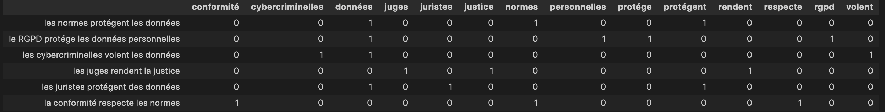
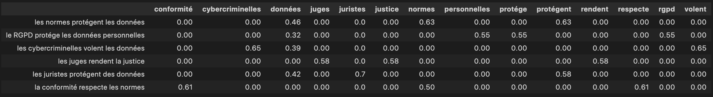
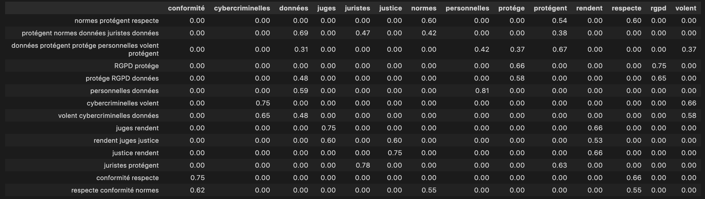

# La signature sémantique des mots

## Comment capturer le sens des mots ?`

### L'hypothèse distributionnelle 

Les chercheurs ont proposé plusieurs méthodes pour capturer la sémantique des mots. Elles ont toutes un point commun : regarder le contexte du mot,  "dis-moi qui tu fréquentes et je te donnerai ton sens" ! Le voisinage d'un mot, les autres mots qu'il fréquente produisent le sens. C'est ce qu'on appelle le contexte.

Les mots qui interviennent dans des contextes similaires tendent à avoir une signification proche. On appelle cette approche **l’hypothèse de distribution** : les mots qui sont sémantiquement proches tendent à être utilisés dans le même contexte.

#### Compter le nombre de mots par document

Prenons plusieurs phrases afin d'illustrer notre propos. 


```py
phrases = [
'les normes protégent les données', 'le RGPD protége les données personnelles', 'les cybercriminelles volent les données', 'les juges rendent la justice', 'les juristes protégent des données', "la conformité respecte les normes"]
```

La première approche est de compter le nombre de mots dans chacune d'elles. On a supprimé les mots non signifiants (stopwords) comme les déterminants pour ne conserver que les mots ayant une valeur sémantique. 



Pour chaque phrase, on a référencé les mots qui y sont contenus. La phrase est le contexte du mot. 

Le problème de cette approche est que chaque mot a un poids équivalent. Les déterminants ont le même poids que les verbes mais leur intérêt en terme sémantique est inférieur. 

Pour résoudre ce problème, on peut utiliser une technique très simple appelée [TF-IDF](https://fr.wikipedia.org/wiki/TF-IDF). 

L'idée est d'attribuer un poids aux mots en fonction de deux facteurs : 

- TF : leur nombre d'apparitions dans le texte (ici des phrases) ;
- IDF : leur nombre d'apparitions dans tout le corpus (dans toutes les phrases).



Désormais, les mots sont répartis en fonction de leur poids. On voit que le mot "données" a des valeurs dans toutes les phrases sauf une. Si on lit la colonne le concernant, on voit la distribution des contextes. Par exemple, il ne pèse rien en ce qui concerne la justice ou les juges dans notre corpus puisqu'il n'y apparaît pas. On voit que ces superpositions permettent de donner un sens contextualisé au mot. 

#### Prendre en compte le contexte des mots 

Dans notre exemple précédent, le contexte est une phrase mais on peut généraliser à une fenêtre autour du mot, c'est-à-dire n mot(s) avant et n mot(s) après. Ainsi, notre contexte n'est plus la phrase mais les mots qui l'entourent avec une fenêtre plus ou moins large. 

On isole un (n=1) mot avant et un après un autre puis on reconstitue des phrases (les contextes). On fait le même calcul TF-IDF et on obtient la matrice suivante : 



En découpant de la sorte, un plus grand nombre de contextes apparaissent donc on affine dans quel espace sémantique les mots sont référencés. Si on isole les colonnes, on obtient des tableaux de nombres qui positionnent le mot dans un espace vectoriel. 

Dans notre exemple, le contexte est présenté avec les mots servant à le calculer mais on peut le généraliser. On aura un contexte évoquant la justice, la sécurité, la conformité, etc.

Ce tableau de nombres, appelé vecteur, est la **signature sémantique** du mot. Il référence les différents sens que peut prendre un mot. 

Pour **expliciter encore notre propos**, voici des mots avec des contextes plus clivants que notre exemple précédent. 

| | Avocat | Juge | Cinéma | Litterature | Aspirine | 
| ---| ----- | ---- | ----- | ----- | ----- |
| Justice | 0,78 | 0,77 | 0,18 | 0,15 | 0,04 |
| Nourriture | 0,2 | 0,06 | 0,18 | 0,23 | 0,09 |
| Soin | 0,2 | 0,22 | 0,11 | 0,10 | 0,7 |

Ce tableau fournit une quantification des pour chaque mot de la quantité de sens/contexte qu'il contient. L'avocat évoque la justice (0,78) mas également la nourriture (0,2). Le cinéma peut être associé, par ses représentations, aux trois contextes : justice, nourriture et soin mais moins qu'aspirine pour ce dernier item. 

En poursuivant, notre raisonnement, on peut lire le tableau de deux manières : 

- en ligne, on voit la répartition des mots sur chaque contexte ;  
- en colonne, on voit le poids de chaque contexte au sein d'un mot.

La colonne représente le vecteur du mot. A partir de cette représentation, nous pouvons faire des opérations mathématiques comme calculer la similarité, faire des soustractions ou des additions. 

En pratique, l'obtention de ces vecteurs et des contextes est le résultat de l'entraînement d'un réseau de neurones. Les sens/contextes sont représentés sous forme d'indice dans un tableau et non explicitement comme dans mon exemple. 

#### Un exemple de construction de vecteurs : word2vec

En 2013, un papier de recherche, intitulé  ["Efficient Estimation of Word Representations in Vector Space"]([https://arxiv.org/abs/1301.3781][]), montre comment construire ces représentations à partir d'un réseau de neurones.

La solution est d'entraîner un réseau de neurones à découvrir un mot masqué entouré de deux mots qu'il connaît ou l'inverse : découvrir les mots qui entourent un mot connu.

Au départ, on choisit la taille de représentation d'un mot, c'est-à-dire sa dimension ou le nombre de sens/contextes différents qu'il pourrait prendre. Si l'on prend une dimension de 64, on initialisera les 64 valeurs de manière aléatoire. Dans ce cas, chaque case a une valeur même minime à la différence de nos exemples précédents où certaines étaient nulles. 

Puis on construit le vocabulaire à partir de notre corpus, c'est-à-dire l'ensemble des mots contenus dans nos textes. 

Viens ensuite le choix du mode d'apprentissage. Si l'on opte pour masquer un mot, le modèle devra deviner le mot masqué en fonction des n mots avant-après. 

Pendant l'entraînement, le réseau doit attribuer la probabilité, parmi tous les mots du vocabulaire, que chaque mot soit le mot manquant. 

Au départ, les paramètres étant aléatoires, il va fortement se tromper. 

Un mécanisme mathématique permet de boucler sur le réseau en indiquant quels sont les paramètres (les poids) qui sont reponsables des erreurs les plus manfestes. Ce processus itératif est évalué à chaque cycle et le réseau doit améliorer son apprentissage pour minimiser ses erreurs. 

Arrivé en fin de processus, les paramètres optimums sont trouvés. Ces paramètres correspondent au poids des 64 contextes-sens associés à un mot. 

On peut alors extraire nos vecteurs associés à chaque mot pour les réutiliser pour d'autres tâches comme de la recherche, de la classification, etc. 


#### Exemple : word2vec entraîné sur la directive NIS 2

Voici quelques lignes de code qui illustrent une représentation vectorielle de mots à partir du texte de la [directive NIS 2]  (https://eur-lex.europa.eu/legal-content/FR/TXT/?uri=uriserv%3AOJ.L_.2022.333.01.0080.01.FRA&toc=OJ%3AL%3A2022%3A333%3A). 

Afin de vous épargner les étapes de prétraitrement, sans intérêt dans notre cadre, j'ai pré-entraîné un modèle avec librairie [Gensim](https://radimrehurek.com/gensim/index.html).

````python
!pip install gensim
from gensim.models import Word2Vec
model = Word2Vec.load('nis2.model')

mot = "sécurité"

print(f"Voici les 10 premiers nombres représentant les coordonnées du mot {mot} : \n {model.wv[mot][:10]}\n")

print("Cette représentation permet notamment de rechercher les mots les plus similaires dans le même corpus :", model.wv.most_similar('identification'))
```
````
``Voici les 10 premiers nombres représentant les coordonnées du mot sécurité : [-0.21285973 0.5637689 0.20553416 -0.06742156 0.03788706 -0.7225273 0.11224744 0.9837986 -0.36839244 -0.33970815]``

``Cette représentation permet notamment de rechercher les mots les plus similaires dans le même corpus : [('fiabilité', 0.9851323962211609), ('signatures', 0.9841110110282898), ('listes', 0.9839881658554077), ('cadre', 0.9838947653770447), ('protection', 0.9838393926620483), ('niveau', 0.9837104082107544), ('partie', 0.9837022423744202), ('électroniques', 0.983534574508667), ('directive', 0.9835230112075806), ('l’utilisation', 0.9835212230682373)]``
``

## Encore plus de contextes... 

Le problème de notre approche est que les différents sens, représentés par notre vecteur, ne prennent pas en compte la subtilité des différents contextes. 

Par exemple, le mot avocat peut être vu dans le contexte de la nourriture ou de la justice. Avec notre système de type *word2vec*, notre représentation du mot est unique. Elle ne change pas en fonction du contexte dans lequel il apparaît. 

Une première approche a consisté à ajouter au vecteur de base, d'autres vecteurs qui matérialisent d'autres contextes. Ainsi le vecteur initial se verra enrichi et affiné en fonction d'autres contextes sémantiques. 

Dans cette optique, le mot 'avocat' dans les phrases 'l'avocat a livré une plaidoirie au vitriol" et "la salade d'avocat était délicieuse", aura clairement des vecteurs de contextes différents en plus de vecteurs représentant la sémantique de base du mot.

Cette solution était obtenue en entraînant des réseaux dits récurrents (RNN). Le but était de découvrir le mot suivant en fonction d'une séquence précédente. Le langage a besoin de mémoire pour fonctionner efficacement. En effet, pour deviner un mot, il faut que je connaisse les mots précédents. Cette architecture permettait de mémoriser l'information. 

Bien qu'efficace, de nombreux problèmes techniques rendait cette solution lente et difficile à entraîner. 

Face à ce problème, des chercheurs ont proposé une architecture qui allait révolutionner le domaine : **les Transformers**. 
