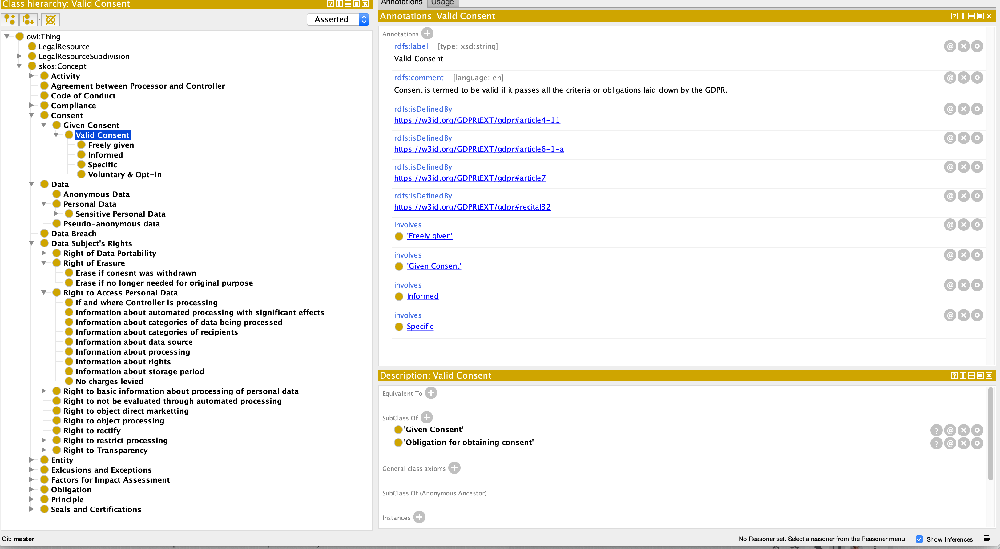
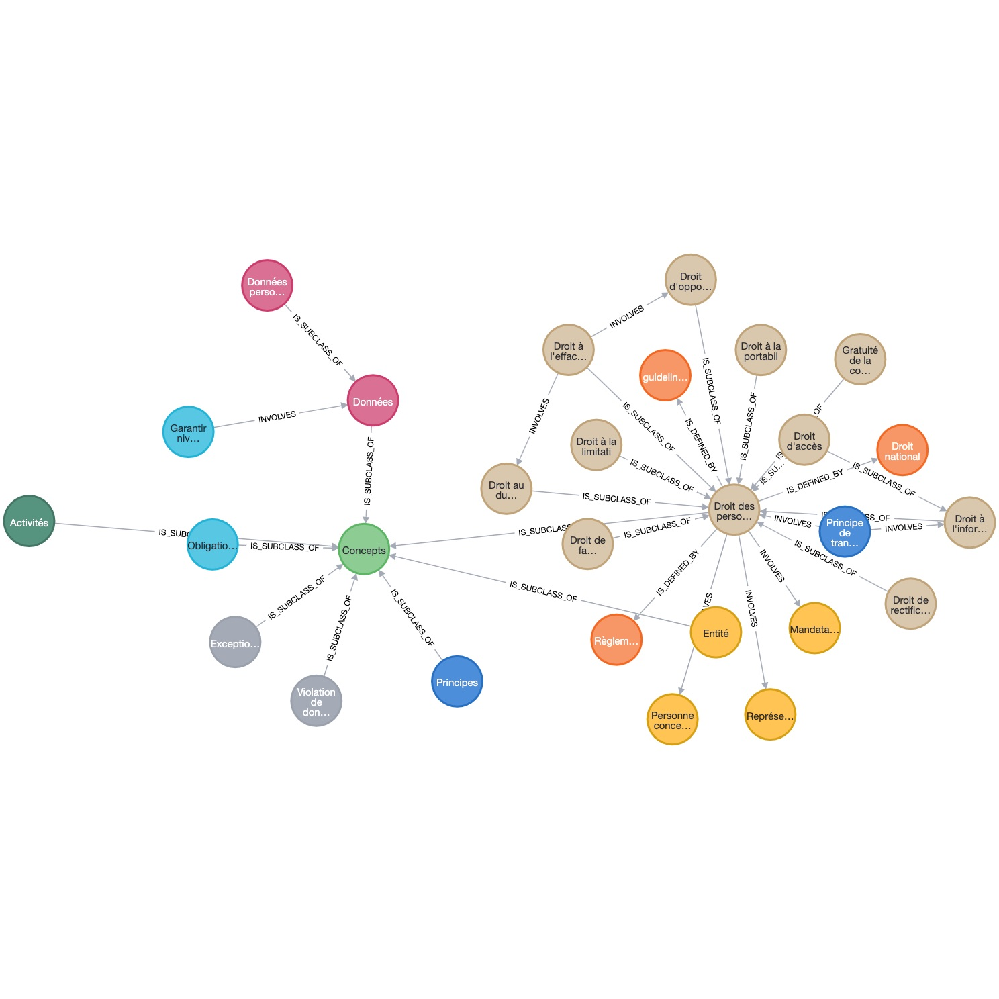

# Ontologie et Knowledge Graph

En informatique, une ontologie est un "corpus structuré de concepts, \[qui est modélisé] dans un langage permettant l’exploitation par un ordinateur des relations sémantiques ou taxonomiques établies entre ces concepts". Dit autrement, c'est une manière de structurer des connaissances en vue d'être utilisées par des machines.

Les ontologies appartiennent à la branche de l'IA dite symbolique qui a pour but de reproduire le raisonnement humain en le modélisant. Elles sont intensivement utilisées en biologie, médecine mais peu dans le domaine du droit. 

Les deux grands objectifs des ontologies sont : 
- permettre la mise en œuvre de raisonnements automatiques ;
- partager la connaissance en formalisant la représentation de la connaissance.

Sur le plan conceptuel, les ontologies reposent sur trois composants : 
- les classes qui regroupent des concepts, des choses ou des objets ;
- les relations qui relient les classes entre elles ; 
- les propriétés ou les caractéristiques associées aux classes. 

On retrouve également ce concept dans une branche que l'on appelle le web sémantique qui vise à structurer [les pages HTML ](Elles servent aussi de fondement à ce que l'on appelle [le web sémantique](https://fr.wikipedia.org/wiki/Web_s%C3%A9mantique). )pour les traiter automatiquement. Un exemple très emblématique est [la base wikidata](https://www.wikidata.org/wiki/Wikidata:Main_Page) qui contient des centaines de milliers de nœuds reliés entre eux pour former une base de connaissance. 

Les graphs de connaissance (*Knowledge Graph*) sont une autre manière d'utiliser les ontologies de manière concrète et construisant un graph fondé sur ces dernières. Ils peuvent être utilisés de manière autonome des ontologies. 

Pour illustrer ce concept, penchons-nous sur une ontologie conceptualisant le RGPD. 

### Une ontologie du RGPD 

Les ontologies obéissent à des principes mais la liberté prévaut. Il n'existe pas une norme mais plusieurs approches, avec leur ressemblance, pour décrire un domaine de connaissance. 

Les quelques paragraphes qui suivent sont inspirés d'un papier intitulé ["GDPRtEXT - GDPR as a Linked Data Resource"](https://openscience.adaptcentre.ie/ontologies/GDPRtEXT/deliverables/docs/ontology). 

Dans cette ontologie, on retrouve les textes juridiques découpés en chapitres, sections, articles, points et sous-points qui permettent d'avoir une granularité fine et de mettre en évidence les concepts qui sont définis par ces textes. 

Voici une visualisation de l'ontologie originale [au format OWL](https://www.w3.org/OWL/) via l'outil gratuit [Protégé](https://protege.stanford.edu/) : 

On y aperçoit toute une série de concepts : le consentement de la personne concernée, les activités sur responsable de traitement, les exceptions ou les grands principes. Ces concepts sont organisés hierarchiquement ou de manière transverse via une relation d'implication ('involves'). Ils sont rattachés au texte *via* une relation nommée 'is defined by'. 

Ces liens font sens dans le cadre du RGPD et permettent de s'y retrouver dans un ensemble assez touffu. L'ontologie peut être utilisée pour servir de grille d'audit par exemple. Mais, pour aller plus loin, on peut intégrer cette ontologie dans une structure plus souple mais plus puissante : les *Knowledge Graph*. 

### Un exemple d'intégration et d'utilisation dans neo4j 

Les *Knowledge Graph* sont utilisés dans des domaines très variés et présentent des caractéristiques avantageuses parmi lesquelles : 
- une très grande liberté dans l'organisation des données ;
- une grande simplicité puisqu'ils sont composés uniquement de nœuds et de relations entre eux ;
- une capacité à être utilisés par de non-techniciens (le graph parle de lui-même). 

Un exemple d'utilisation célèbre est l'investigation concernant les *Panama Papers*. Le graph a été construit de manière automatique à partir de millions de données regroupant des emails, des pdf, des images et des bases de données. A partir d'une structure nœud/relation simple, ressemblant à celle que l'on trouve au Registre du Commerce et des Sociétés, un graph a été construit avec le nom des sociétés, les mandataires, les actionnaires et des milliers d'informations contenues dans les données ayant fuité. 

En utilisant un langage permettant d'interroger le graph, il est possible d'obtenir des informations cachées très pertinentes comme remonter l'intégralité des flux financiers, ou faire des corrélations entre les prête-noms. 

Revenons au RGPD. Sans présenter la volumétrie des * Panama Papers*, c'est une législation complexe et ramifiée qui touche à d'autres domaines comme la cybersécurité. Il est possible de conceptualiser ce domaine avec un *Knowledge Graph* et d'y appliquer des traitements complexes pour auditer des documents, générer des clauses, bâtir des outils de formation. 

Voici une illustration à partir de quelques nœuds extraits de la base RGPD dans AuraDB : 

Cet outil possède un langage de requêtes qui lui est propre (Cipher) et qui permet entre autres : 
 - de rapatrier toutes les relations entrantes et sortantes depuis un nœud ;
 - de calculer la popularité (nombre de liens) d'un nœud ;
 - de trier les relations selon leur sens, leur type... 

Ces résultats, couplés à l'aide des outils de recherche sémantique pour rapatrier les noms, peuvent fournir une aide précieuse pour organiser les connaissances aux ramifications complexes. 

A ce stade, il faut une intervention humaine pour construire le graph et l'alimenter dans un premier temps. Il existe de nombreuses démonstrations sur la création automatique de ce type de base de données notamment en extrayant les relations entre entités. 

### La création automatique d'ontologies

Cette[ expérience](https://github.com/daveshap/SCOTUS_GPT3_Opinions) a été menée sur des décisions de justice américaine avec [le format json-ld](https://json-ld.org/) à l'aide de GPT 3.x. 
Bien qu'imparfait, GPT a pu générer des fichiers dans un format structuré à partir des opinions de la Cour Suprème des Etats-Unis. C'est un premier pas modeste vers une capacité à raisonner. Le sujet est à creuser notamment en droit français. 

la création automatique d'ontologies se heurte à de nombreux obstacles parmi lesquels : 

- **l'ambiguité** : un mot peut avoir plusieurs sens en fonction du contexte et établir un lien entre deux concepts peut se révéler particulièrement ardu ;
- **le poids des concepts** : la capacité humaine à trier les choses importantes ou non n'est pas possible lors d'un traitement automatique. Dans le cas d'une ontologiee créée automatiquement, il faut arriver à trier ce qui est important dans le champ de connaissance et ce qui est accessoire. Cet objectif est très difficile à atteindre (voire impossible à ce jour) ; 
- **la complexité des formulations** : je vous laisse trouver des exemples dans les contrats ou les décisions de justice... 

Liens sur la génération de Graph à partir de GPT : 
- https://medium.com/neo4j/knowledge-graph-based-chatbot-with-gpt-3-and-neo4j-c4ebbd325ed
- https://towardsdatascience.com/gpt-3-for-doctor-ai-1396d1cd6fa5
- https://www.topbots.com/guide-to-knowledge-graphs/
- https://pub.towardsai.net/automatic-knowledge-graphs-the-impossible-grail-ef71f9c8aad8

