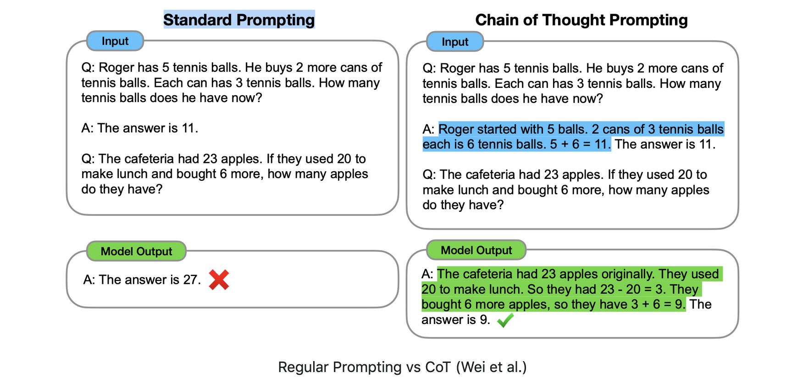
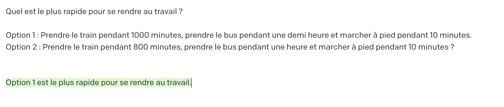
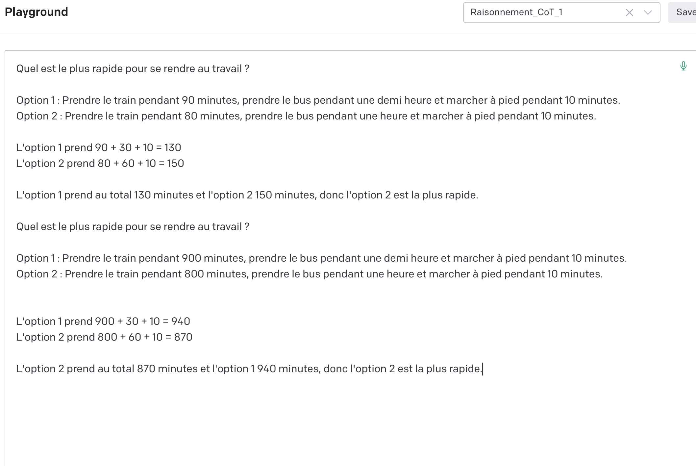
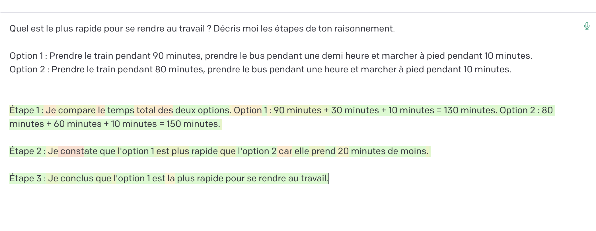

# L'art du prompting : un aperçu 

!!! abstract  "Ce qu'il faut retenir" 

	- le prompting est la manière de piloter les modèles de langage comme GPT 3 pour obtenir des résultats précis : Questions/Réponses, raisonnement logique ou résumé
	- il s'agit de textes rédigés en langage naturel dont les règles ne sont pas formellement énumérées
	- il existe différentes approches en fonction des objectifs à remplir : de la formulation standard aux instructions étape par étape sophistiquées (*Chain of Thought*)

L'objectif de ces quelques pages est de fournir une initiation au pilotage des nouveaux modèles de langage comme ChatGPT. La force de ce type d'outil est de fournir une interface intuitive entre l'Homme et la machine. Il suffit de poser des questions en langage naturel pour avoir la réponse avec une fiabilité plus ou moins grande. 

En effet, ces modèles de langage sont dit génératifs, c'est-à-dire qu'ils générent des mots appelés tokens à partir d'une séquence connue. Cette séquence est précisément votre question. 

A partir de cette approche, on peut aller beaucoup plus loin dans la manière dont les humains peuvent intéragir avec ces modèles et leur faire exé uter des tâches précises comme un raisonnement logique, faire preuve de bon sens ou effectuer des opérations d'arithmétique. C'est précisément cet ensemble de techniques que je vous propose de décrire. 

L'objectif est de fournir un aperçu de cette (toute) nouvelle discipline passionnante qui fait l'objet de recherches intenses notamment par les équipes de Google. Je reviendrai plus en détails dans des exemples concrets sur la façon dont le prompting peut être utilisé en matière juridique. 

## Prompting  ?  

En réalité, le prompting n'est rien d'autre qu'un bout de texte qui vise à faire exécuter au modèle une tâche précise : rédiger un résumé, répondre à une question ou traduire un texte. 

C'est une interface entre l'homme et le modèle. Cette interface ne correspond pas à un langage formalisé comme du code informatique ou ce que l'on utilise sous Excel. 

Comme ces modèles ont 'vu' pendant leur phase d'apprentissage un nombre considérable d'exemples, ils sont capables de se situer dans le contexte fourrni par la séquence -  le *prompt* - renseigné par l'utilisateur. Il utilise sa capacité à reconnaître les *patterns* appris pour les répliquer dans la phase de *completion* qui vise à générer les mots. Cette caractéristique très intéressante fait qu'ils peuvent être utilisés pour [remplir de nombreuses tâches ](https://arxiv.org/pdf/2005.14165.pdf)sans avoir besoin de les ré-entraîner sur des jeux de données spécifiques. 

Par exemple, le prompt suivant très simple commande au modèle de résumer un texte : 

!!! Note "Prompt standard pour résumer un texte"
	Résume moi en 100 mots le texte suivant : 
	
	Texte : 
	
	Résumé :

On peut également lui fournir une liste d'exemples comme des questions/réponses et lui dire de continuer à répondre selon ce schéma. Plus subtile, on peut introduire des instructions pour répondre à la manière d'un mathématicien, d'une juriste, d'un enfant... 

## Du prompting standard à la chaîne de pensées

La manière de s'adresser au modèle a d'abord été d'être direct, à l'instar de l'exemple précédent. ll suffit de lui demander sans forme ni détour le résultat qu'on souhaite, comme on le fait en demandant à chatGPT de répondre à une question. 

Rapidement, il est apparu que le prompting standard n'était pas efficace dans des opérations de raisonnement logique, où il faut faire preuve de bon sens ou effectuer des opérations d'arithmétique. 

Fort de ce constat, un papier a proposé une approche plus ambitieuse en fournissant, toujours via le *prompt*, les étapes que le modèle doit accomplir pour aboutir au résultat final. Cette approche est appelée ['Chain of Thought Prompting'](https://arxiv.org/pdf/2201.11903.pdf)

Dans cette approche, on a toujours une structure générale de quelques exemples de Questions/Réponses mais on explicite dans la réponse le chemin à parcourir pour obtenir la solution. Cette stratégie obtient de très bons résultats mais elle n'est efficace que sur les modèles de langage avec de nombreux paramètres (supérieurs à 100 millards). 

Il existe plusieurs raffinements concernant cette stratégie : 

- [Zero Shot Chain of Thought](https://arxiv.org/pdf/2201.11903.pdf) : l'idée est de faire créer par le modèle lui-même les étapes du raisonnement avec la commande ('Raisonne étape par étape') puis d'injecter la réponse fournie à la suite du problème pour atteindre le résultat. On ne fournit rien au modèle comme exemple ("zero shot") et il élabore lui-même son raisonnement. Génial, non ? On verra que cette propriété est utilisée et systématisée dans certains frameworks comme  [Demonstrate Search Predict. ](https://github.com/stanfordnlp/dsp)
-  [Self-Consistency](https://arxiv.org/pdf/2203.11171.pdf)  ou auto-consistance : cette technique consiste à générer plusieurs chaînes d'instructions pour un même problème puis à retenir la solution qui revient la plus fréquemment. 

## Quelques régles pour rédiger de bons prompts

Il ne faut pas perdre de vue que l'histoire du prompting n'a que quelques mois. Les progrès dans le domaine du traitement automatique du langage ont été tellement rapides que ces quelques lignes sont sûrement déjà obsolètes. 

Toujours est-il qu'il existe quelques règles, parfois contre-intuitives, concernant l'efficacité de la rédaction d'un prompt : 

- le fait de donner une bonne réponse dans les exemples fournis n'est pas significatif sur la performance obtenue par le modèle. Autrement dit, il apprend du pattern et non de la véracité de ce qui lui est fourni ; 
- le format est très important. Il commande la manière dont le modèle va générer la réponse par exemple sous forme de liste séparée par des virgules ou en majuscule ;
- le nombre d'exemples optimal est souvent de 4 à 8.

## Exemples de prompts courants 

### Prompts standards  : 

### Chain of Thought 

Dans cet exemple, GPT (davinci 003) se trompe et n'arrive pas à "raisonner" pour trouver la bonne réponse. 

On raffine le prompt en ajoutant : 

- la manière de calculer les deux trajets ; 
- un ou plusieurs exemples (*few shots CoT*) pour lui montrer le type de raisonnement. 

Dans ce cas, il arrive au bon résultat en explicitant les étapes de son raisonnement. 

Il est possible, pour se passer de lui décrire quelques exemples, d'introduire un prompt "magique" du type " Décris-moi les étapes de ton raisonnement ". On parlera de *zeroshot Chain Of Thought*. 

-------

Liens : 

- [Learning Prompt](https://learnprompting.org/docs/)
- [Prompting GPT-3 To Be Reliable](https://arxiv.org/abs/2210.09150)
- https://www.outilsfroids.net/2023/02/vous-dorkiez-jen-suis-fort-aise-et-bien-promptez-maintenant/
- [Language Models are Few-Shot Learners](https://arxiv.org/pdf/2005.14165.pdf)

