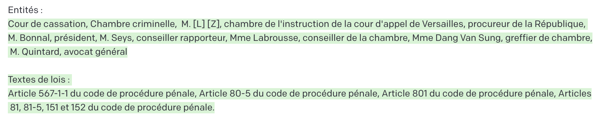

# Legal NLP : état des lieux 
*Date de la version : 20/01/2023*

*Cet état des lieux est issu de mes notes personnelles et de mes lectures (les liens en fin d'article). La matière évoluant très rapidement désormais, je mettrai régulièrement à jour cet article*.

Cela fait plusieurs années que l'industrie du droit est défiée par de nouvelles sociétés innovantes souvent regroupées sous le terme *legaltech*. Des solutions très intéressantes ont émergé de ce bouillonnement :  

- amélioration considérable des outils de recherche grâce à des solutions comme [Doctrine](https://www.doctrine.fr) ;
- automatisation de la production documentaire et notamment des clausiers ;
- [gestion "intelligente" des contrats](https://hyperlex.ai) :
- [extraction automatique d'informations clés pour analyser des documents ](https://www.doctrine.fr/document-analyzer?sourcePage=FeaturesPage&source=header)

Ces solutions intégrées reprennent les tâches de base que l'on peut attribuer à des solutions de legalNLP. 

Pourtant, malgré ces progrès, le coeur de l'activité des professionnels du droit - à savoir le maniement de la langue et des mots - paraissaît peu sujet à des disruptions majeures. L'arrivée sur le marché des Large Language Model (ci après LLM) avec leur capacité à résumer, analyser et produire du texte pourrait désormais changer la donne. Au-delà de l'intérêt du grand public pour des outils comme chatGPT, le monde du droit a tout intérêt à s'intéresser de près à ces technologies, y compris à travers une approche métier forte. 

Face à **l'engouement récent pour la version packagée de GPT** sous forme d'un agent conversationnel, il y a deux écoles : les enthousiastes béats qui ont déjà envahi les plateaux de télévision et qui prétendent que le métier d'avocat et bien d'autres sont déjà passés aux oubliettes ; es sceptiques qui ont de solides arguments à opposer concernant la fiabilité des sources et les travers de cette technologie et tous défauts incompatibles avec une pratique professionnelle du droit (mais également dans d'autres domaines comme la médecine). 

La vérité, comme souvent, semblent se situer entre les deux. Pour autant, je pencherai plutôt du côté des enthousiastes, modérés, pour des solutions dans un avenir proche - horizon deux/trois ans - et j'expliquerai plus en détails pourquoi dans les paragraphes suivants. 

## Pour une culture d'interface 

La différence entre sceptiques et enthousiastes se fait souvent entre ceux qui utilisent chatGPT comme un produit fini, véritable boîte noire à qui l'on demanderait tout et n'importe quoi. L'outil est tellement fascinant et sa capacité à entretenir une conversation cohérente - mais pas forcément juste -  fait que beaucoup se sont mis à lui poser des questions très pointues notamment en matière juridique. Etonnamment, on obtient d'assez bons résultats en [droit américain ](https://papers.ssrn.com/sol3/papers.cfm?abstract_id=4335905)mais la réponse dans des domaines techniques est souvent insipide, truffée de généralités voire carrément fausse. 

Ces errements ne doivent pas cacher une réalité : ces modèles en sont à leurs débuts et il y a fort à parier qu'ils vont changer de manière significative le monde juridique dans les années à venir. La différence se fera alors non plus entre dubitatifs ou groupies mais entre ceux qui ont une culture d'interface, c'est-à-dire à la fois une capacité à comprendre cette matière même de manière intuitive et à éventuellement utiliser ces modèles dans leur pratique, et les autres. 

Il y a plusieurs domaines ou usages pour lesquels on peut conjecturer une avenir transformé : 

- la capacité à personnaliser les outils de manière très fine avec des technologies jusque-là réservées au géants du secteur ;
- l'assistance à la génération de documents ;
- la recherche dans des corpus documentaires maison pourrait compléter les outils du marché ;
- les audits automatiques notamment dans les matières complexes comme la cybersécurité, les normes en tout genre... ;
- les revues qualité de documents internes ;
- assistance juridique interne ou externe sous forme de chatbot ;
- ...

Afin de commencer notre chemin dans la culture d'interface, j'aborderai la question du traitement automatique des langues et sa place actuelle dans le domaine juridique.  On verra rapidement les limites, principales et [[#Les autres défis | secondaires]], de l'exercice lorsqu'on cherche à appliquer la technique au [[#Les limites des modèles : le raisonnement|raisonnement]] mais les récentes avancées offrent des [[#Surmonter les limitations avec les LLM ? | solutions prometteuses.]]

## Le traitement du langage : une place centrale dans la pratique du droit 

Le traitement automatique du langage ou NLP (Natural Language Processing) a connu [plusieurs époques ](https://medium.com/@antoine.louis/a-brief-history-of-natural-language-processing-part-1-ffbcb937ebce)mais son[ âge d'or a vraisemblablement commencé en 2017](https://medium.com/@antoine.louis/a-brief-history-of-natural-language-processing-part-2-f5e575e8e37) avec les *transformers* dont sont issus GPT 3.x et d'autres modèles. Ses objectifs sont restés les même depuis les débuts de la discipline dans les années 50 : fournir un ensemble de techniques pour effectuer des tâches relatives au langage habituellement effectuées par des humains. Ces tâches sont [[très variées et peuvent être plus ou moins sophistiquées]]. 

Pour les juristes, cette branche de l'IA joue un rôle central car elle permet d'extraire des informations à partir de données, écrites ou vocales, non structurées. On entend par non structurées des données qui ne sont pas formattées à l'origine pour être exploitées. Elles peuvent être de sources très variées : correspondance, jurisprudence, articles de doctrine, actes de procédure... A l'inverse,  [[les datasets pré formattés pour l'apprentissage de tâches précises]] sont un exemple de données structurées.

### Illustration : les étapes de traitement pour l'analyse d'un contrat

Je reprends ici les grandes lignes de la mise en œuvre du projet d'audit de documents, présenté en formation, en utilisant plusieurs briques technologies dont la recherche sémantique et le traitement de document à l'aide de LLM. 

Les étapes simplifiées de l'analyse d'un contrat illustrent le découpage nécessaire à une machine pour automatiser partiellement l'analyse d'un document : 

1. Le document doit être pré-traité. Il s'agit de le nettoyer des informations non pertinentes et surtout de le découper en blocs tout en conservant le sens de chaque partie. Par exemple, il est possible d'extraire d'un document les phrases, éventuellement regroupées en paragraphes ou chapitres et dans le meilleur des cas d'essayer de conserver la structure du document initial. En effet, dans ce contexte, la hiérarchie - le plan - a une importance sémantique. Souvent, on utilise différentes techniques dont des réseaux de neurones ou des modèles plus [simples de machine learning ](https://github.com/stanfordnlp/pdf-struct)
2. Il est nécessaire d'extraire du document une première série d'informations comme le nom  des parties, les dates, les juridictions, les articles de loi... Là encore, des modèles généralistes ou entraînés spécifiquement peuvent être utilisés. 
3. Un classifieur peut être appliqué pour identifier et extraire les clauses que l'on veut analyser : confidentialité, non-concurrence, attributive de compétence, responsabilité... 
4. Les extraits identifiés peuvent être automatiquement analysés en fonction d'une échelle préqualifiant un risque ou en utilisant des modèles d'inférence (NLI). 
5. Toutes ces informations peuvent être compilées, insérées dans d'autres programmes pour traitement et évaluation. 

Toutes les briques logicielles pour ces traitements existent avec une fiabilité plus ou moins grande qu'il faut savoir appréhender en fonction de la criticité des objectifs. 

## Homme vs Machine 

D'emblée, on voit que l'automatisation nécessite de mettre en œuvre une pyramide de techniques pour ce qui peut prendre quelques minutes à un humain. 

Cependant, la machine présente des avantages comparatifs : 

- la capacité à traiter un nombre très important de documents 
- l'établissement de liens entre plusieurs sources d'informations (lois, jurisprudence, registres légaux, doctrine...) 

A l'inverse, l'humain excelle dans d'autres domaines :

- la compréhension de la langue alors que la machine repose sur des modèles purement mathématiques ; 
- l'appréhension d'un problème à partir d'un faible nombre d'exemples ; 
- l'application d'un raisonnement juridique qui n'est pas accessible à la machine sauf à utiliser des techniques commes les ontologies ([[ontologie_knowledge_graph]]) ou à décomposer [les prompts en Chain of Thought ](LLM_art_prompting.md) métiers.

## Les limites des modèles : le raisonnement 

Pour illustrer la position du problème, imaginons que l'on veuille prédire l'issue d'un litige. Cette activité, que certains nomment[ justice prédictive ou algorithmisée](https://www.jean-jaures.org/publication/mecanisme-dune-justice-algorithmisee/), peut faire l'objet de plusieurs approches techniques. 

### L'extraction de régularités statistiques 

Ici, la première étape est extractive : il s'agit d'utiliser des techniques permettant d'isoler les différents éléments d'une décision comme nous l'avons vu pour les contrats. Le modèle de NLP doit pouvoir identifier les parties, les textes appliqués, les faits et la décision finale. Si l'on admet que cette tâche est correctement effectuée, on pourra alors faire tourner d'autres modèles pour capturer des schémas statistiques qui permettront de prédire l'issue d'un litige en fonction de plusieurs éléments comme la nature du litige, les faits, la juridiction... L'issue du litige étant ici une classification discrète (perd/gagne) ou continue comme le montant d'une indemnisation, d'une pension alimentaire ou une prestation compensatoire. 

Cette approche admet plusieurs limites : 

- les techniques de NLP ne peuvent identifier à elles seules les informations pertinentes. Dans ce cas, un homme de l'art est nécessaire pour identifiant les éléments clés et invariants d'un litige ;
- cette approche est plus adaptée au système de *common law* que dans les pays de droit civil ;
- la limitation majeure provient, selon moi, de l'incapacité à obtenir un raisonnement qui prenne en compte les faits, leur qualification et l'application de la règle de droit.

### Les difficultés de l'implémentation d'un raisonnement juridique

Pour réellement arriver à raisonner, il faudrait que nos techniques de NLP soient capables d'orchestrer les connaissances et de leur appliquer des mécanismes d'inférence.

Les [[ontologie_knowledge_graph |ontologies et/ou les graphs de connaissance ]]présentent des avantages certains pour appréhender le raisonnement juridique. Ci-dessous, une approche du RGPD que j'ai implémentée dans [une base de données spécialisée ](https://neo4j.com/). La connaissance est représentée sous forme de triplets sujet-verbe-objet. 

Ainsi le RGPD possède des concepts qui se déclinent en entités, en droit des personnes, en données, etc. Chaque sous-concept est relié aux autres par un lien hiérarchique, une relation d'implication pour évoquer la transversalité, une référence à sa définition pour relier les textes ou la jurisprudence au concept. 

Cette structuration de l'information permet une manipulation très puissante. Ainsi, on peut extraire facilement les liens fonctionnels entre les activités de traitement et les entités concernées. L'ensemble fait sens et permet d'inférer des obligations, des droits, des activités prohibées, etc. Seulement, ce graph nécessite une intervention humaine en amont et sa construction automatique à partir des techniques du NLP est impossible (malgré quelques promesses non tenues de fournisseurs de solutions). 

Il existe de nombreux tutoriels qui détaillent comment créer des ontologies à partir de bases de données de films par exemple. Dans ce cadre, le but est d'extraire les liens entre le sujet (un acteur, un producteur, un réalisteur) et les objets (les films). Le NLP utilise plusieurs techniques pour y arriver : Part Of Speech, analyse des dépendances, Name Entity Recognition, etc.

Mais en matière juridique, la complexité du graph à construire interdit de considérer ce procédé automatique comme fiable. 

Cette limitation ne peut pas être surmontée aujourd'hui y compris par les LLM. Pour autant, cette approche peut apporter des avancées majeures au domaine du traitement automatique du droit. J'y reviendrai. 

## Surmonter les limitations avec les LLM ? 

Comme nous l'avons mentionné, les LLM apportent des avancées importantes qui peuvent bénéficier au domaine du droit : 

#### L'apprentissage avec pas ou peu d'exemples (*zero shot & few shots learning*)

Cette caractéristique, sur laquelle je reviens en détails dans [[LLM_art_prompting |l'art du *prompting*]] permet au modèle d'être utilisé pour des tâches spécifiques en lui fournissant aucun ou très peu d'exemples. 
Elle représente un atout car il  vient pallier la rareté et le coût de constitution des données labélisées disponibles en droit français.  

Par exemple, le *prompt*  "Extrait les textes de lois et les entités nommés du texte suivant au format csv." appliqué à l'[arrêt de la chambre criminelle du 29 novembre 2022](https://www.legifrance.gouv.fr/juri/id/JURITEXT000046683011?dateDecision=&init=true&page=1&query=convention+secr%C3%A8te&searchField=ALL&tab_selection=juri) donne le résultat suivant : 

Bien entendu, ces résultats sont à affiner et à évaluer. Cependant, on aperçoit le caractère remarquable de GPT (*davinci-003*) à reconnaître des entités là où il fallait entraîner au préalable un modèle avec plusieurs milliers d'exemples. C'est une des illustrations de la puissance du *zero shot learning*. 

Il serait intéressant de comparer les résultats au tryptique titrages, résumés, textes appliqués fourni par le Bulletin. 

En revanche, cette habileté seule ne permet pas de raisonner mais de se passer d'un long et coûteux apprentissage. Si ces modèles peuvent faire économiser du texte, ont-ils l'aptitude à bâtir un schéma de connaissance ? 

#### L'élaboration automatique d'ontologies

Si l'on poursuit notre idée, notre réseau pré-entraîné pourrait être capable d'extraire des structures qui pourraient ensuite être utilisées dans des graphs de connaissance. Cette[ expérience](https://github.com/daveshap/SCOTUS_GPT3_Opinions) a été menée sur des décisions de justice américaine avec [le format json-ld](https://json-ld.org/).
Bien qu'imparfait, GPT a pu générer des fichiers dans un format structuré à partir des opinions de la Cour Suprème des Etats-Unis. C'est un premier pas modeste vers une capacité à raisonner. Le sujet est à creuser notamment en droit français. 

Le NLP doit répondre à d'autres défis complémentaires pour arriver à sa pleine maturité dans le domaine juridique. 

# Les autres défis

## La diversité des documents juridiques constitue une premier écueil

Les documents juridiques prennent des formes variées et n'obéissent pas à des modèles préformattés.  Ce formalisme extensif engendre des problèmes spécifiques lorsqu'il s'agit d'extraire l'information d'un document. 

### L'identification de la structure documentaire

Certes, la matière juridique conduit à produire du contenu plus structuré que dans d'autres domaines mais le formalisme peut être plus ou moins strict. 

Par exemple, il n'existe pas de structure réellement unifiée respectée par les décisions de justice même si l'on peut s'appuyer sur des [plans de classement parfois très performant]([administrative](https://www.legifrance.gouv.fr/affichNomenclatureAdmin.do?id=CETANOME000008361640)). Le blog d'Emmanuel Barthe en fournit un [intéressant état des lieux. ](https://www.precisement.org/blog/Intelligence-artificielle-en-droit-derriere-la-hype-la-realite.html#nb255)

Dans la documentation produite par les avocats, il existe également une grande variété de structures. La répétition de schémas types comme en matière contractuelle permet d'[entraîner des  modèles de machine learning classiques](https://aclanthology.org/2021.nllp-1.15/) pour extraire la structure hiérarchique et les unités de texte (paragraphes) pour effectuer des traitements en aval. 

### Quel niveau de granularité ?

Un problème courant en NLP est la taille des données à traiter. L'architecture [[Les Transformers|des transformers]] conduit à une limitation des séquences en entrée qui peuvent être traitées en même temps. Cette limitation porte sur le nombre de tokens (un token égal à peu près 0,75 mot ). 

La plupart des documents juridiques dépassent largement la fenêtre, comprise entre 500 et 4000 tokens, utilisée par ces modèles. 

Cette caractéristique contraint à segmenter le texte en plusieurs morceaux avec une perte inévitable d'informations. Une des solutions, illustrée dans la mise en pratique sur le moteur de recherche sémantique, consiste à superposer partiellement les segments mais cette solution n'est pas toujours satisfaisante. En effet, le découpage arbitraire amène parfois à dégrader l'analyse du sens. 

## La pénurie de jeux de données 

Malgré l'aptitude à apprendre à partir de peu d'exemples, il est souvent nécessaire d'alimenter les modèles en données d'apprentissage. 

Les progrès récents de l'open data en matière judiciaire sont très encourageants mais le droit français manque cruellement de datasets structurés à la fois pour l'apprentissage et pour établir des benchmarks. 

Je référence dans l'article consacré [aux jeux de données](/Notions_Essentielles/1_Dataset/)  (*dataset*), ceux qui sont accessibles publiquement en droit français ou francophone (droit belge, suisse principalement ). 

Si vous avez connaissance d'autres jeux de données, n'hésitez pas à m'écrire. 